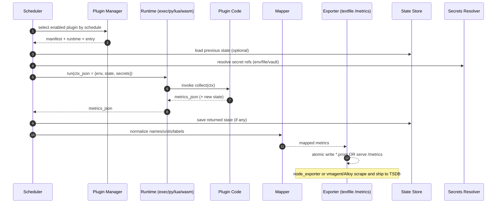

Metricraft

Легкий агент-конструктор кастомних метрик із підтримкою плагінів (exec / Python / Lua / WASM), мапінгом у Prometheus, hot-reload і базовим hardening (seccomp + cgroup v2). Фокус — швидке додавання власних метрик без переписування системного моніторингу.

Компроміс: простий у старті, швидкий у виконанні, безпечний для недовірених плагінів завдяки WASI/ізоляції процесів.

Основні можливості
- Плагіни: exec (універсально), python (вбудований інтерпретатор для trusted), lua (вбудований), WASM/WASI (шаблон + планується рантайм).
- Контракт єдиний: ctx_json → metrics_json через stdin/stdout або collect(ctx) (Python/Lua).
- Exporter: Prometheus textfile (готово) або /metrics (можна додати паралельно).
- Mapper: перетворення ваших імен/одиниць у стандартні (node_load*, node_procs_*, ratio тощо).
- Hot-reload: автоматичне перевантаження плагінів за mtime.
- Hardening: seccomp-профілі для exec, шаблони cgroup v2.
- State roundtrip: опційне збереження стану плагіна між викликами.

Безпека (база)
- exec: запускайте під окремим юзером; застосовуйте seccomp (hardening/seccomp/*.json) і cgroup v2 (hardening/cgroupv2/create_and_attach.sh).
- python/lua: для trusted коду (мʼякий таймаут). Недовірений або частий код — краще WASM/WASI.
- textfile writer: атомарний запис .tmp → .prom, umask 077.

Roadmap
- M0 (готово): ядро (scheduler, exec/python/lua), textfile, mapper, приклади, hardening-шаблони.
- M1: /metrics endpoint (паралельно з textfile), self-metrics агента.
- M2: WASM-рантайм (Wasmtime/WASI): preopen, fuel, memory-cap + приклад SDK для Rust.
- M3: інтеграції: готові приклади з vmagent/Grafana Alloy для транспорту (scrape/remote_write).
- M4: hot-reload watcher, JSON Schema для маніфестів/виводу, мінімальний transform-шар (перейменування/labels).
- M5: exec-wrapper з seccomp+cgroup із коробки; Helm/Compose приклади деплою.

Чому саме так (просто/швидко/безпечніше)
- Простота: плагіни — звичайні скрипти/бінарі/модулі з одним JSON-контрактом; atomic textfile — без підводних каменів.
- Швидкодія: безважкий C++-ядро; для гарячих плагінів — WASM без fork/exec.
- Безпека: процесна ізоляція (exec + seccomp/cgroup) або WASI-пісочниця.

```mermaid
flowchart LR
  %% ====== Metricraft: Component Architecture ======
  classDef core fill:#0ea5e9,stroke:#0369a1,color:#fff;
  classDef rt   fill:#22c55e,stroke:#15803d,color:#fff;
  classDef io   fill:#f59e0b,stroke:#b45309,color:#fff;
  classDef sec  fill:#ef4444,stroke:#991b1b,color:#fff;
  classDef ext  fill:#e5e7eb,stroke:#6b7280,color:#111;
  classDef plug fill:#a78bfa,stroke:#6d28d9,color:#fff;

  subgraph HOST[Host]
    A[Agent Core]:::core

    subgraph CORE[Core]
      PM[Plugin Manager<br/>(manifests scan, hot-reload)]:::core
      SCH[Scheduler<br/>(interval, jitter, timeout)]:::core
      MAP[Mapper → Prometheus names/units]:::core
      SS[State Store<br/>(per-plugin JSON)]:::core
      SR[Secrets Resolver<br/>(env/file/vault refs)]:::core
      TF[Textfile Writer<br/>(atomic *.prom)]:::io
      HTTP[/metrics Exporter (opt)]:::io
    end

    subgraph RUNTIMES[Runtimes]
      RT1[ExecRunner<br/>(stdin→stdout)]:::rt
      RT2[PyRunner<br/>(embedded CPython)]:::rt
      RT3[LuaRunner<br/>(embedded Lua)]:::rt
      RT4[WasmRunner<br/>(WASI/Wasmtime)]:::rt
    end

    subgraph HARDENING[Hardening]
      SEC[seccomp profiles]:::sec
      CG[cgroup v2 limits]:::sec
      UL[ulimit/umask]:::sec
    end

    subgraph PLUGINS[Plugins dir]
      MF[( *.yaml manifests )]:::plug
      P1[[Your plugin N<br/>(exec/py/lua/wasm)]]:::plug
    end

    OS[/proc, FS (preopen),<br/>Network (optional)]:::ext
  end

  %% External ecosystem
  subgraph OUTSIDE[External]
    NE[node_exporter<br/>textfile collector]:::ext
    VM[vmagent / Grafana Alloy<br/>(scrape/remote_write)]:::ext
    TSDB[(Prometheus | VictoriaMetrics | Mimir)]:::ext
    VAULT[(Vault / K8s/Docker Secrets)]:::ext
    DBAPI[(DBs/APIs the plugins read)]:::ext
  end

  %% Wiring
  A --- CORE
  A --- RUNTIMES
  A --- HARDENING
  PM --> MF
  SCH -->|dispatch ctx_json| RUNTIMES
  SR -->|inject secrets| RUNTIMES
  SS -->|load state| RUNTIMES
  RUNTIMES -->|metrics_json| MAP --> TF
  MAP --> HTTP
  TF --> NE
  HTTP --> VM --> TSDB
  NE --> TSDB
  VAULT -.-> SR
  DBAPI -.read.-> P1
  OS -.preopen/limited.-> RT4
  SEC -.enforce.-> RT1
  CG -.limit.-> RT1
  UL -.harden.-> A

```

