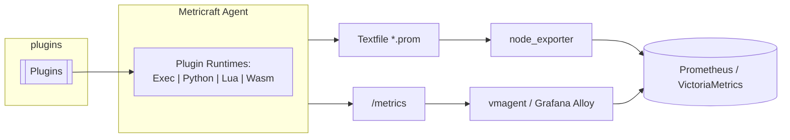

Metricraft
---

Agent for building custom metrics with plugin support (Exec, Python, Lua, WASM).

---

```mermaid
flowchart LR
 subgraph Agent["Metricraft Agent"]
        Runtime["Plugin Runtimes:<br> Exec | Python | Lua | Wasm"]
        %% MAP["MAP"]
  end
 subgraph P["plugins"]
        PLUG[["Plugins"]]
  end
    %% MAP --> EXP
    PLUG --> Runtime
    Agent --> TF["Textfile *.prom"] & HTTP["/metrics"]
    TF --> NE["node_exporter"]
    HTTP --> SHIP["vmagent / Grafana Alloy"]
    NE --> TSDB[("Prometheus / VictoriaMetrics")]
    SHIP --> TSDB
```

